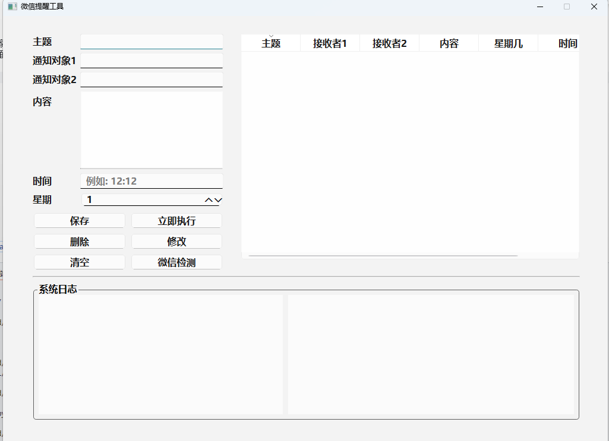

# 微信提醒工具

## 场景
- 小孩上学和放学，通知家人帮忙接送小孩!!!
- 每周要定时向公司群里面发内容!!
- 消息轰炸机!!慎用，小心被拉黑

## 功能
- [x] 支持同一消息发送两个联系人
- [x] 支持计划消息的存储，存储在sqlite中
- [x] 支持按照每周计划发送消息
- [x] 时间按照24小时制



## 依赖Python包
- PyQt6
- schedule
- pytz

## 打包
打包前，需要安装`nuitka`打包工具
```
python -m nuitka --onefile --output-dir="./output"   --windows-disable-console --enable-plugin=pyqt6 --include-module=schedule --include-module=wxauto --include-module=sqlite3  --include-module=comtypes --include-module=pytz --jobs=4  main.py
```

## 定制开发联系

